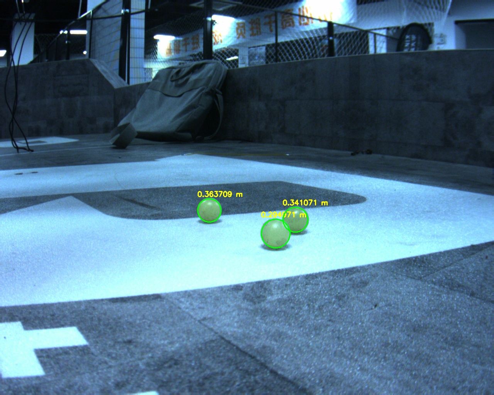

# 作业2
opencv 图像处理

## 寻找失落的 ~~神之眼~~ 小弹丸

### 背景故事
学长是打 RM 的老兵。技术素养过硬，自瞄稳如老狗，就是有一个致命个人习惯：👉 调试完从来不清理小弹丸。
他说那不是懒，是“战场余晖的沉淀”。久而久之，实验室角落、桌子缝隙、键盘底下到处都是 流浪小弹丸。
它们像文明遗迹一样散落在各个坐标点，见证着学长无数次锁敌、反杀与被裁判警告的辉煌历史。
某天，学长在调车的时候一个战术后仰——咔。摔倒瞬间他盯着天花板，悟了
———“是时候结束这场弹丸的因果循环了。”
于是，他决定启动终极计划：
寻找失落的 ~~神之眼~~ 小弹丸

### 要求
画出小弹丸的圆形轮廓，并给出其到相机的距离(选做)

### 提示
1. 小弹丸是绿色的球体
~~这家伙在讲什么啊~~
2. 小弹丸在图片中可能不止出现一次
3. 相机内参矩阵 cameraMatrix：
> [1284.547433507284, 0.0, 651.7508235222139,
>  0.0, 1284.2364120767988, 526.5637803861928,
>  0.0, 0.0, 1.0]
4. 相机畸变系数 distCoeffs：
> [-0.37358321087789575, 0.17992488578084675, -0.0003940895801771612, -0.0007097534681170694, 0.0]
5. 我们认为在相机中小弹丸是圆形的
6. 好像可以用相机内参矩阵和畸变系数来计算小弹丸到相机的距离（PnP），但是PnP的输入是什么呢.....~~学长又玩上了原神~~
7. 本题对距离结果的精度要求不高，不需要特别精确

### 作业说明
- 需识别的图片在 `assignment_2/detector/imgs` 目录下
- 仅需识别示例图片中的绿葡萄，**对代码的泛用性不做要求**
- 请在 `assignment_2/detector/` 目录下完成作业，上传*代码*和*结果图片.jpg*，其他文件请勿上传
- 必须包含`CMakeLists.txt`、`.cpp`、`.hpp`以及在`detector/imgs`目录下的结果图片

### 示例

## 拯救芙芙计划

### 背景故事
学长正沉浸在欣赏芙宁娜照片的美好时刻，眼神专注、神情陶醉，完全没注意到身后草丛里传来窸窸窣窣的动静。结果下一秒丘丘人突然冒了出来！
一声怪叫，木棒呼啸而下，学长当场“强制下线”。
等他再睁开眼，世界一片安静，丘丘人早已不见踪影，只剩他孤零零地躺在地上。学长第一反应不是检查自己有没有事，而是猛地坐起身——“我的芙宁娜！”
低头一看，那张珍贵的照片已经被踩得皱皱巴巴。学长心如刀绞，仿佛受伤的不是照片，而是他的灵魂。
现在，他郑重请求你
——请帮学长把这张承载着信仰与爱的芙宁娜照片修复如初。 

### 作业说明
- 需处理的图片在 `assignment_2/reparier/imgs` 目录下
- 请在 `assignment_2/repairer/` 目录下完成作业，上传*代码*和*结果图片.jpg*，其他文件请勿上传
- 必须包含`CMakeLists.txt`、`.cpp`以及在`repairer/imgs`目录下的结果图片

